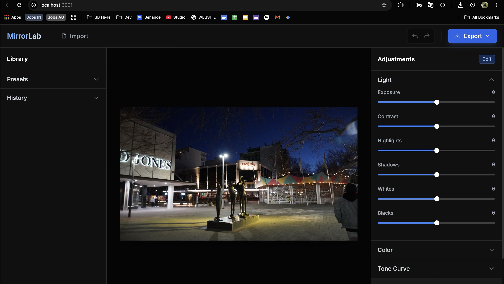

# MirrorLab 📸


**MirrorLab** is an open-source, browser-based professional photo editor capable of RAW processing, advanced color grading, and non-destructive editing. Built with modern web technologies, it aims to be a lightweight alternative to Lightroom Classic.

 
*(Note: Screenshot to be added after first run)*

## ✨ Features

- **🖼️ RAW File Support**: Import and edit `.CR2`, `.NEF`, `.ARW`, `.DNG`, and other RAW formats directly in the browser.
- **📈 Advanced Tone Curve**:
    - Multi-Channel support (Master, Red, Green, Blue).
    - Precise numeric inputs for point control.
    - Smooth, spline-based interpolation.
- **🎨 Comprehensive Color Tools**:
    - **HSL / Color Mixer**: Adjust Hue, Saturation, and Luminance for 8 individual color channels.
    - **Grading**: Standard Exposure, Contrast, Highlights, Shadows, Whites, and Blacks.
    - **White Balance**: Temperature and Tint controls.
- **⚡ High Performance**:
    - WebGL-ready architecture (currently Canvas 2D optimized).
    - Real-time preview generation.
    - Client-side processing (Privacy focused - images never leave your device).
- **💾 Export**: Save your work as High-Quality PNG, JPEG, or WebP.

## 🚀 Getting Started

### Prerequisites

- Node.js (v18 or higher)
- npm or yarn

### Installation

1.  **Clone the repository**:
    ```bash
    git clone https://github.com/pronzzz/mirrorlab.git
    cd mirrorlab
    ```

2.  **Install dependencies**:
    ```bash
    npm install
    ```

3.  **Run the development server**:
    ```bash
    npm run dev
    ```

4.  **Open in Browser**:
    Visit `http://localhost:3000` to start editing!

## 🗺️ Roadmap

We have ambitious plans to take MirrorLab beyond the browser:

- [ ] **Cross-Platform Desktop Apps**: Native wrappers for **macOS**, **Windows**, and **Linux** (via Electron or Tauri).
- [ ] **Mobile Application**: Porting the engine to **Android** and **iOS** (React Native).
- [ ] **WASM Core**: Migrating heavy image processing to C++/Rust via WebAssembly for native speed.
- [ ] **Local Library Management**: File system access to manage folders without importing.
- [ ] **Masking Tools**: AI-based subject selection and linear/radial gradients.

## 🛠️ Technology Stack

- **Frontend**: React 19, TypeScript, Vite
- **Styling**: TailwindCSS, Lucide Icons
- **Image Processing**: HTML5 Canvas API (custom spline interpolation engine)
- **RAW Decoding**: `exifr` (Preview extraction), `libraw` (Planned for full decode)

## 🤝 Contributing

Contributions are welcome! Please read our [CONTRIBUTING.md](CONTRIBUTING.md) for details on our code of conduct, and the process for submitting pull requests.

## 📄 License

This project is licensed under the MIT License - see the [LICENSE](LICENSE) file for details.

---
*Built with ❤️ by [Pranav Dwivedi](https://github.com/pronzzz)*
